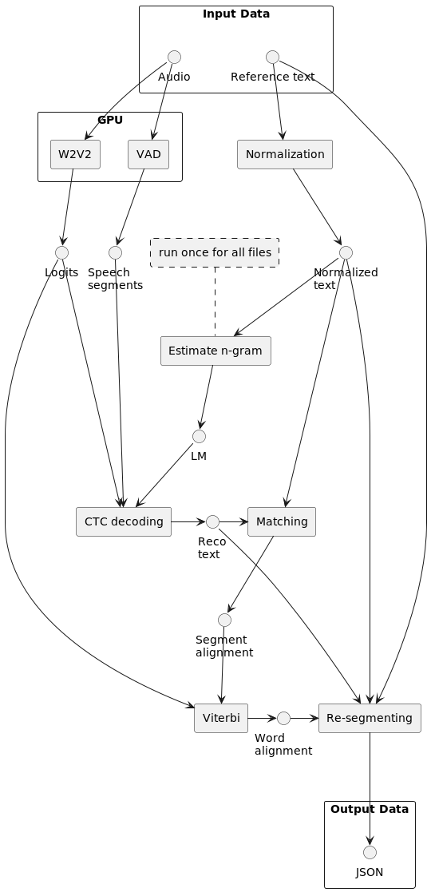

# Large dataset processing

This folder contains methods for processing large datasets. The focus here lies
on ways to optimize the pipeline both in terms of duration and cost of processing.

## Pipeline

The procedure is described using the following diagram:



The rectangles represent the procedures and algorithms, whereas points are the various
datastructures and files generated by the individual steps. The dashed rectangle is used
as a note.

The pipline describes the processing of each individual audio and reference text pair.
That means that each step is applied to a single pair, except for N-gram estimation,
which is performed only once, at the beginning, on the entire dataset.

Experiments with estimating the N-gram model on a single set of transcriptions proved
less efficient, since the audio file doesn't necessarily match the transcript accurately.
Also, giving the model a greater context helps with better generalization of the language model.
In fact, giving extra domain data could be even more beneficial.

## How-to usage

1. Extract logits

```bash
python -m large.get_logits [audio.wav] [model_url] [logits.npz]
```

2. Apply VAD

```bash
python -m large.vad.get_segments [audio.wav] [vad.json]
```

(Note: go to the [vad](vad) folder for more details on how to perform this step)

3. Normalization

```bash
python -m src.normalize [transcript.txt] [normalization.json]
```

This step will usually depend on the model being used and the complexity of the transcript.
The code above does the bare minimum, which is to lowercase the text and remove all non-letter and digit
characters (in terms of RegEx - all `[^\w]` characters).

A slightly more complex example [here](https://github.com/danijel3/TextNormalizePL) uses SpaCy and some hand-crafted
rules.

4. Estimate N-gram

This one can be solved using several different toolkits. Since you need to do this only once, you can
choose whatever you find most convenient. For most methods, you will need to extract the normalized text
to a separate file:

```bash
python -m src.normalized_text [normalization.json] [normalization.txt]
```

You would then merge all the individual text files and train a model on that corpus. For example, if you want
to use [SRI LM](http://www.speech.sri.com/projects/srilm/download.html):

```bash
ngram-count -text [normalization.txt] -order 3 -kndiscount -interpolate -lm [ngram.arpa]
```

Or if you want to use [KenLM](https://github.com/kpu/kenlm):

```bash
kenlm/bin/lmplz -o 3 --text [normalization.txt] --arpa [ngram.arpa]
```

Other toolkits include:

* [IRSTLM](http://hlt-mt.fbk.eu/technologies/irstlm) - good for large corpora
* [MITLM](https://github.com/mitlm/mitlm) - really simple to use, but seems abandoned
* [pocolm](https://github.com/danpovey/pocolm) - optimized for ASR

You can also convert your ARPA model (which is a text file) to a binary KENLM format, which is much faster to load:

```bash
build_binary [ngram.arpa] [ngram.bin]
```

Finally, you should also prepare a list of all the words in the model and store it to a file called `unigrams.txt`. This
can be done using the SRILM tool:

```bash
ngram -lm [ngram.arpa] -write-vocab [unigrams.txt]
```

Or otherwise, you can simply parse the ARPA file yourself and copy the unigrams from there.

5. CTC decoding

```bash
python -m large.reco_from_logits [logits.npz] [vad.json] [ngram.lm] [unigrams.txt] [w2v2_model] [reco.json]
```

6. Matching

```bash
python -m large.get_match [reco.json] [normalization.json] [match.json] 
```

7. Alignment

```bash
python -m large.align_from_logits [match.json] [logits.npz] [w2v2_model] [ali.json]
```

8. Re-segmenting

```bash
python -m large.resegment [ali.json] [reco.json] [norm.json] [output.json]
```

## Procedure details

### W2V2

This represents the application of the wav2vec2 speech model used for creating a matrix of
so-called "logits" directly from the audio. The logits contain likelihoods of chosen speech
token the model was fine-tuned to. These could be different for different languages or even
models within one language. For example, some models are trained to recognize only letters, while others
can recognize letters, numbers and other special characters. Yet other models can be trained to
recognize subword or other linguistic units.

These logits can be used to recognize speech using various methods of "decoding", or they can
be used to align known text to the audio. There are probably other linguistic applications, but
they are not going to be discussed in this project.

This process has the obvious benefit of being able to run on a GPU, which gives it
a significant speed boost. The output is a numpy array which, when stored in a compressed file,
takes up a fraction of the original audio file size. This means, that this step can easily be moved
to a powerful GPU machine, whereas the rest of the pipeline can run on a regular CPU machine.

### VAD

Stands for Voice Activity Detection. This step is necessary for very long files that contain a lot
of "dead-air" or otherwise untranscribed portions of audio. We use VAD to extract only relevant
parts of the audio, and we can also discard segments that are deemed unlikely to be present in the
transcript. For example, we can make an assumption that any segment with energy below a certain
threshold is likely "background speech", which usually doesn't get transcribed.

Similarly to the W2V2 step, this step can also be moved to a GPU machine. The suggested approach
utilizes the [Pyannote](https://github.com/pyannote/pyannote-audio) library, which makes quick work
of even very long audio files.

### Normalization

The purpose of this step is to convert the original transcript into a form that is
as similar as much as possible to what the W2V2 model above outputs. If the model outputs
only letters, we should discard any digits and symbols from the text. Also, the text should
most likely be lowercased.

The output of this process also contains a mapping between the original (un-normalized) and
normalized texts. This is important for the last "Re-segmenting" step, which tries to match
the output of the matching and Viterbi alignment to the original form of the transcript.

### Estimate N-gram

### CTC decoding

### Matching

### Viterbi

### Re-segmeting

## Sample performance